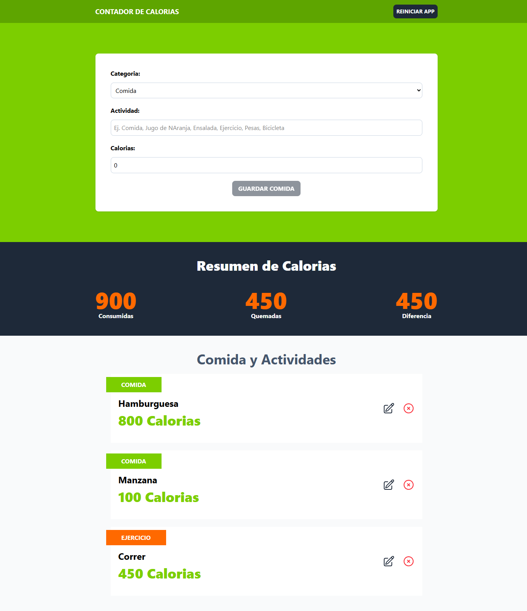

# Contador de Calorias 🍔🍎😋​​🚵​💪​​

Contador de calorias, hecho en ReactJS con TypeScript, con las siguientes características:

- Se registra la actividad: "Comida" o "Ejercicio", indicando el nombre de esta y el numero de calorias de la actividad.
- Las actividades en la categoria "Comida", suman calorias.
- Las actividades en la categoria "Ejercicio", restan calorias.
- Calcula el total de calorias consumidas, quemadas y la diferencia entre ambas.
- Se puede editar o eliminar una actividad.
- Se puede resetear(borrar) todas las actividades.
- Usa "localStorage" para almacenar las actividades.
- Usa el hook "useReducer" para manejar el estado de las actividades.
- Uso del hook "useMemo" para el performance.
- New: Uso de "Context" para el estado global (y no usar tantas props :)).
- Utiliza TailwindCSS para los estilos.
- Uso de Heroicons para los iconos de "Editar" y "Eliminar".
- New: scroll hacia el componente "Form", al momento de editar una actividad.

## Run Server 🏃​

Para **desarrollo**: 

1) Instalar dependencias.

```bash
pnpm i
```

2) Correr servidor con:

```bash
pnpm run dev
```
___

Para **producción**: 

1) Repetir pasos No.1 de desarrollo.

2) Generar carpeta "dist" con:

```bash
pnpm run build
```

3) Subir carpeta "dist" al servidor.
    
## Screenshots

